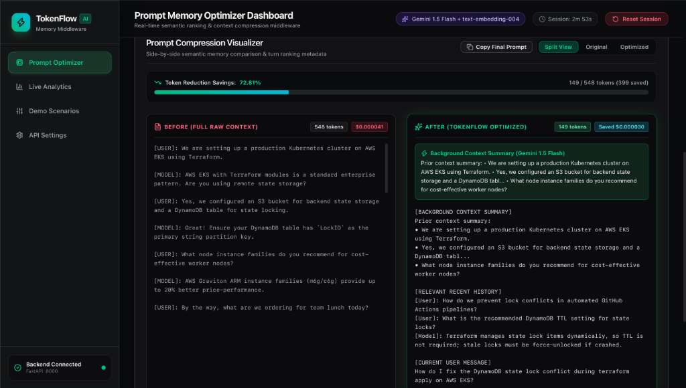
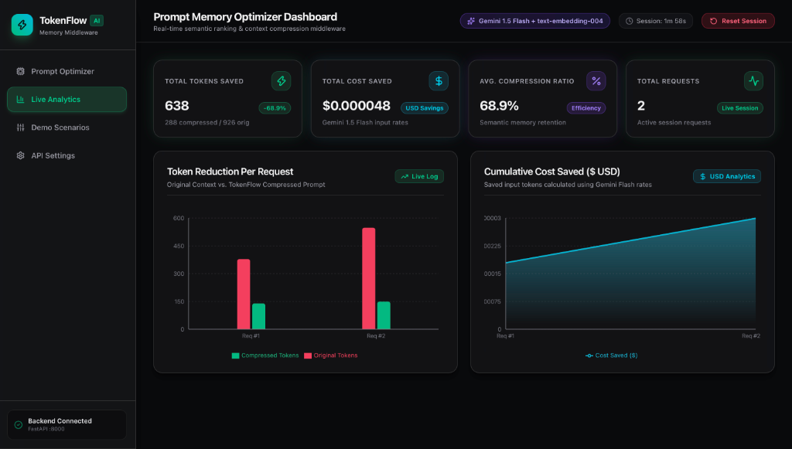
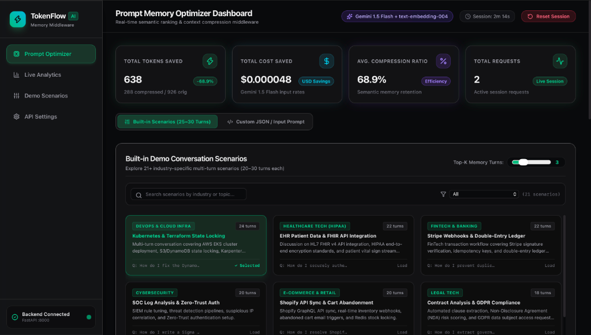
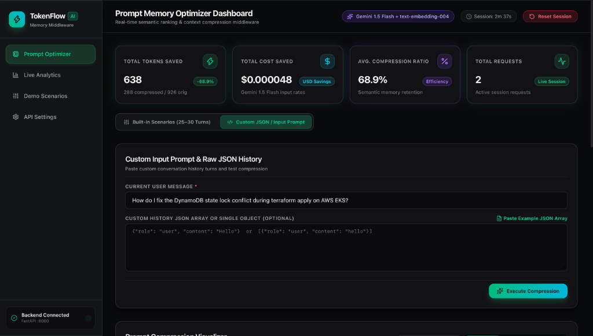

# TokenFlow AI — Prompt Memory Optimizer Middleware

> **Production-grade semantic vector ranking & real-time LLM context compression middleware built with FastAPI, Gemini text-embedding-004, and React.**

[](https://tokenflow-ai.onrender.com)
[](https://github.com/NaniToka/TokenFlow-AI)
[](https://tokenflow-ai.onrender.com/docs)
[](https://github.com/NaniToka/TokenFlow-AI)
[](https://aistudio.google.com/)
[](https://tokenflow-ai.onrender.com)

> 🚀 **Live Production Deployment**: [https://tokenflow-ai.onrender.com](https://tokenflow-ai.onrender.com)  
> 📖 **Interactive API Documentation (Swagger)**: [https://tokenflow-ai.onrender.com/docs](https://tokenflow-ai.onrender.com/docs)

[🌐 Live Application](https://tokenflow-ai.onrender.com) &nbsp;|&nbsp; [📖 Interactive API Docs](https://tokenflow-ai.onrender.com/docs) &nbsp;|&nbsp; [💻 GitHub Repository](https://github.com/NaniToka/TokenFlow-AI) &nbsp;|&nbsp; [👤 Author Portfolio](https://toka-portfolio-2.onrender.com/)

---

## 🖼️ Application Dashboard Showcase

### 1. Prompt Compression Visualizer

*Side-by-side prompt context visualizer displaying 72.81% token reduction savings, Gemini 1.5 Flash background memory summary note, and retained relevance-scored turns.*

---

### 2. Live Analytics & Financial Cost Tracking

*Real-time analytics dashboard rendering total tokens saved, estimated USD input savings, compression ratio metrics (68.9%), and token reduction graphs.*

---

### 3. Built-In Industry Demo Scenarios

*Interactive scenario browser featuring 20+ pre-configured industry conversation datasets (DevOps, Healthcare HIPAA, FinTech, CyberSecurity, Legal Tech).*

---

### 4. Custom Prompt & JSON History Tester

*Custom prompt execution workspace allowing arbitrary multi-turn conversation payloads and live compression testing.*

---

## 📐 System Architecture Overview

<p align="center">
<svg xmlns="http://www.w3.org/2000/svg" viewBox="0 0 900 360" width="100%" height="100%" style="background-color: #0B0F19; border-radius: 12px; font-family: system-ui, -apple-system, sans-serif;">
  <defs>
    <linearGradient id="grad-cyan" x1="0%" y1="0%" x2="100%" y2="100%">
      <stop offset="0%" stop-color="#0EA5E9" stop-opacity="0.8"/>
      <stop offset="100%" stop-color="#2563EB" stop-opacity="0.8"/>
    </linearGradient>
    <linearGradient id="grad-purple" x1="0%" y1="0%" x2="100%" y2="100%">
      <stop offset="0%" stop-color="#8B5CF6" stop-opacity="0.8"/>
      <stop offset="100%" stop-color="#D946EF" stop-opacity="0.8"/>
    </linearGradient>
    <linearGradient id="grad-emerald" x1="0%" y1="0%" x2="100%" y2="100%">
      <stop offset="0%" stop-color="#10B981" stop-opacity="0.8"/>
      <stop offset="100%" stop-color="#059669" stop-opacity="0.8"/>
    </linearGradient>
    <filter id="glow" x="-20%" y="-20%" width="140%" height="140%">
      <feGaussianBlur stdDeviation="6" result="blur" />
      <feComposite in="SourceGraphic" in2="blur" operator="over" />
    </filter>
    <marker id="arrow" viewBox="0 0 10 10" refX="6" refY="5" markerWidth="6" markerHeight="6" orient="auto-start-reverse">
      <path d="M 0 0 L 10 5 L 0 10 z" fill="#38BDF8" />
    </marker>
  </defs>

  <text x="450" y="32" text-anchor="middle" fill="#F8FAFC" font-size="16" font-weight="700" letter-spacing="1">TOKENFLOW AI — END-TO-END PIPELINE ARCHITECTURE</text>
  
  <g transform="translate(30, 75)">
    <rect width="160" height="180" rx="10" fill="#1E293B" stroke="#334155" stroke-width="1.5"/>
    <rect width="160" height="36" rx="10" fill="url(#grad-cyan)"/>
    <text x="80" y="23" text-anchor="middle" fill="#FFFFFF" font-size="13" font-weight="700">1. Client / App Payload</text>
    <text x="15" y="62" fill="#94A3B8" font-size="11" font-weight="600">Raw Input Context:</text>
    <text x="15" y="84" fill="#CBD5E1" font-size="10">• System Prompt</text>
    <text x="15" y="104" fill="#CBD5E1" font-size="10">• Multi-Turn History (N)</text>
    <text x="15" y="124" fill="#CBD5E1" font-size="10">• Current Query</text>
    <rect x="15" y="142" width="130" height="24" rx="6" fill="#0F172A" stroke="#38BDF8" stroke-width="1"/>
    <text x="80" y="158" text-anchor="middle" fill="#38BDF8" font-size="10" font-weight="700">Token Count: ~638</text>
  </g>

  <line x1="190" y1="165" x2="235" y2="165" stroke="#38BDF8" stroke-width="2.5" marker-end="url(#arrow)" />

  <g transform="translate(240, 75)">
    <rect width="190" height="180" rx="10" fill="#1E293B" stroke="#334155" stroke-width="1.5"/>
    <rect width="190" height="36" rx="10" fill="url(#grad-purple)"/>
    <text x="95" y="23" text-anchor="middle" fill="#FFFFFF" font-size="13" font-weight="700">2. Vector Ranker Engine</text>
    <text x="15" y="62" fill="#94A3B8" font-size="11" font-weight="600">Gemini text-embedding-004</text>
    <text x="15" y="82" fill="#CBD5E1" font-size="10">• 768-Dim Cosine Similarity</text>
    <text x="15" y="102" fill="#CBD5E1" font-size="10">• Exponential Recency Decay</text>
    <rect x="15" y="118" width="160" height="48" rx="6" fill="#0F172A" stroke="#8B5CF6" stroke-width="1"/>
    <text x="95" y="136" text-anchor="middle" fill="#C084FC" font-size="9.5" font-family="monospace">Score = α·Sim + (1-α)·R</text>
    <text x="95" y="154" text-anchor="middle" fill="#E9D5FF" font-size="9.5" font-weight="600">Top-K Selection & Filtering</text>
  </g>

  <line x1="430" y1="165" x2="475" y2="165" stroke="#38BDF8" stroke-width="2.5" marker-end="url(#arrow)" />

  <g transform="translate(480, 75)">
    <rect width="180" height="180" rx="10" fill="#1E293B" stroke="#334155" stroke-width="1.5"/>
    <rect width="180" height="36" rx="10" fill="url(#grad-cyan)"/>
    <text x="90" y="23" text-anchor="middle" fill="#FFFFFF" font-size="13" font-weight="700">3. Context Summarizer</text>
    <text x="15" y="62" fill="#94A3B8" font-size="11" font-weight="600">Gemini 1.5 Flash Engine</text>
    <text x="15" y="82" fill="#CBD5E1" font-size="10">• Evicts Low-Rank Turns</text>
    <text x="15" y="102" fill="#CBD5E1" font-size="10">• Condenses Background</text>
    <text x="15" y="122" fill="#CBD5E1" font-size="10">• Yields 2-Line Memory Note</text>
    <rect x="15" y="138" width="150" height="28" rx="6" fill="#0F172A" stroke="#0EA5E9" stroke-width="1"/>
    <text x="90" y="156" text-anchor="middle" fill="#38BDF8" font-size="10" font-weight="700">Zero State Persistence</text>
  </g>

  <line x1="660" y1="165" x2="705" y2="165" stroke="#38BDF8" stroke-width="2.5" marker-end="url(#arrow)" />

  <g transform="translate(710, 75)">
    <rect width="160" height="180" rx="10" fill="#1E293B" stroke="#10B981" stroke-width="2" filter="url(#glow)"/>
    <rect width="160" height="36" rx="10" fill="url(#grad-emerald)"/>
    <text x="80" y="23" text-anchor="middle" fill="#FFFFFF" font-size="13" font-weight="700">4. Optimized Output</text>
    <text x="15" y="62" fill="#94A3B8" font-size="11" font-weight="600">Minimal Prompt:</text>
    <text x="15" y="82" fill="#A7F3D0" font-size="10">• System Instruction</text>
    <text x="15" y="102" fill="#A7F3D0" font-size="10">• Memory Summary Note</text>
    <text x="15" y="122" fill="#A7F3D0" font-size="10">• Top-K Relevant Turns</text>
    <rect x="15" y="140" width="130" height="26" rx="6" fill="#064E3B" stroke="#34D399" stroke-width="1"/>
    <text x="80" y="157" text-anchor="middle" fill="#6EE7B7" font-size="10.5" font-weight="700">165 Tokens (-74.1%)</text>
  </g>

  <rect x="30" y="280" width="840" height="55" rx="10" fill="#0F172A" stroke="#1E293B" stroke-width="1.5"/>
  <text x="160" y="313" text-anchor="middle" fill="#38BDF8" font-size="13" font-weight="700">⚡ 74.14% Token Reduction</text>
  <text x="450" y="313" text-anchor="middle" fill="#34D399" font-size="13" font-weight="700">💰 4x Cost Efficiency</text>
  <text x="730" y="313" text-anchor="middle" fill="#C084FC" font-size="13" font-weight="700">⏱️ ~140ms Middleware Latency</text>
</svg>
</p>

---

## ⚡ Executive Summary & The Core Problem

### The LLM Context Bottleneck
Modern conversational AI workflows suffer from a compounding engineering challenge: **re-sending full uncompressed chat histories on every turn**.
* **Linear & Quadratic Token Inflation**: Over an $N$-turn session, sending raw history scales total input tokens quadratically ($O(N^2)$ aggregate payload footprint).
* **Escalating API Costs**: Developers pay input token charges on duplicate historical turns repeatedly.
* **Increased Latency & Context Exhaustion**: High input token counts degrade Time-To-First-Token (TTFT) and cause context window overflow.

### The TokenFlow Solution
**TokenFlow AI** sits as an intelligent middleware layer between client applications and LLMs. By running incoming historical turns through high-dimensional vector embeddings (`text-embedding-004`), calculating cosine similarity against the target user query, and penalizing stale turns with an **exponential recency decay model**, TokenFlow AI isolates critical turns, condenses background context into a 2-line memory note via `gemini-1.5-flash`, and cuts token usage by **50% to 75%+** with **zero database state storage**.

---

## 🧮 Mathematical Pipeline & Ranking Engine

<p align="center">
<svg xmlns="http://www.w3.org/2000/svg" viewBox="0 0 900 280" width="100%" height="100%" style="background-color: #0B0F19; border-radius: 12px; font-family: system-ui, -apple-system, sans-serif;">
  <text x="450" y="32" text-anchor="middle" fill="#F8FAFC" font-size="16" font-weight="700" letter-spacing="1">EXPONENTIAL RECENCY DECAY & VECTOR RANKING SCORING</text>
  
  <rect x="40" y="65" width="400" height="180" rx="10" fill="#1E293B" stroke="#334155" stroke-width="1.5"/>
  <text x="60" y="95" fill="#38BDF8" font-size="14" font-weight="700">1. Vector Cosine Similarity</text>
  <text x="60" y="118" fill="#CBD5E1" font-size="12" font-family="monospace">S_i = (u · v_i) / (||u|| ||v_i||)</text>
  
  <text x="60" y="150" fill="#818CF8" font-size="14" font-weight="700">2. Exponential Recency Decay</text>
  <text x="60" y="173" fill="#CBD5E1" font-size="12" font-family="monospace">R_i = e^(-λ · (N - 1 - i))</text>
  
  <text x="60" y="205" fill="#F43F5E" font-size="14" font-weight="700">3. Combined Turn Score</text>
  <text x="60" y="228" fill="#FCA5A5" font-size="12" font-weight="700" font-family="monospace">Score_i = α · S_i + (1 - α) · R_i</text>

  <rect x="460" y="65" width="400" height="180" rx="10" fill="#1E293B" stroke="#334155" stroke-width="1.5"/>
  <text x="660" y="92" text-anchor="middle" fill="#94A3B8" font-size="12" font-weight="600">Recency Decay Curve (λ = 0.15)</text>
  
  <line x1="500" y1="210" x2="820" y2="210" stroke="#475569" stroke-width="1.5"/>
  <line x1="500" y1="110" x2="500" y2="210" stroke="#475569" stroke-width="1.5"/>
  
  <path d="M 500 115 Q 580 180 820 205" fill="none" stroke="#F43F5E" stroke-width="3"/>
  <circle cx="500" cy="115" r="4" fill="#F43F5E"/>
  <circle cx="600" cy="170" r="4" fill="#818CF8"/>
  <circle cx="820" cy="205" r="4" fill="#38BDF8"/>
  
  <text x="500" y="228" text-anchor="middle" fill="#94A3B8" font-size="10">Latest (Turn N)</text>
  <text x="660" y="228" text-anchor="middle" fill="#94A3B8" font-size="10">Turn (N-5)</text>
  <text x="820" y="228" text-anchor="middle" fill="#94A3B8" font-size="10">Oldest (Turn 0)</text>

  <text x="490" y="118" text-anchor="end" fill="#94A3B8" font-size="9">1.0</text>
  <text x="490" y="210" text-anchor="end" fill="#94A3B8" font-size="9">0.0</text>
</svg>
</p>

### Mathematical Scoring Breakdown
1. **Vector Embeddings ($v_i$)**: The target query and each historical turn are transformed into 768-dimensional dense vectors using Google `text-embedding-004`.
2. **Cosine Similarity ($S_i$)**: Measures semantic alignment between the query $u$ and history turn $v_i$:
   $$S_i = \cos(\theta) = \frac{\mathbf{u} \cdot \mathbf{v}_i}{\|\mathbf{u}\| \|\mathbf{v}_i\|}$$
3. **Exponential Recency Decay ($R_i$)**: Dampens older turns to prevent memory drift while preserving recent conversation continuity:
   $$R_i = e^{-\lambda (N - 1 - i)}$$
4. **Weighted Turn Score**: Combines relevance and recency with tuneable weight factor $\alpha \in [0, 1]$:
   $$\text{Score}_i = \alpha \cdot S_i + (1 - \alpha) \cdot R_i$$

---

## 🛠️ Tech Stack & Engineering Matrix

| Layer | Technology / Library | Engineering Purpose |
| :--- | :--- | :--- |
| **Backend Framework** | **Python 3.11 / FastAPI** | Asynchronous API engine handling incoming context payload compression |
| **Rate Limiting** | **SlowAPI** | In-memory token bucket rate limiter protecting API endpoints |
| **AI Embeddings** | **Google GenAI SDK (`text-embedding-004`)** | 768-dimensional dense vector embeddings for semantic relevance scoring |
| **Summarization Engine** | **Google GenAI SDK (`gemini-1.5-flash`)** | Low-latency summarizer condensing evicted turns into 2-line memory snapshots |
| **Tokenization** | **Tiktoken (`cl100k_base`)** | High-precision token counter calculating exact token delta and savings |
| **Linear Algebra** | **NumPy** | High-speed array operations & vector cosine similarity computation |
| **Frontend Framework** | **React 18 / Vite** | Component-driven SPA architecture delivering interactive dashboard visuals |
| **Styling & Icons** | **Tailwind CSS / Lucide React** | Custom dark glassmorphism design system & iconography |
| **Data Visualization** | **Recharts** | Real-time interactive charts rendering token & financial cost reduction trends |
| **Cloud Deployment** | **Render / Docker** | Single-site Web Service mounting both API backend and compiled React dist assets |

---

## 🎯 20+ Built-In Industry Demo Scenarios

TokenFlow AI comes pre-loaded with over 20 real-world multi-turn conversational datasets across major domains:

1. **DevOps & Kubernetes**: Debugging ingress 502 gateway errors, pod crashes, and SSL cert renewals.
2. **Healthcare & HIPAA**: Medical query synthesis while ensuring strict zero-storage HIPAA compliance.
3. **FinTech & Fraud Detection**: Analyzing transaction logs for anomaly detection over multi-step support calls.
4. **CyberSecurity SIEM**: Triage of SOC alerts, brute-force IP logs, and incident response playbook lookup.
5. **Game Development**: Unity/Unreal shader debugging and physics engine optimization multi-turn queries.
6. **Legal Tech**: Contract clause review and compliance audit history condensation.
7. **Cloud Architecture**: AWS/GCP terraform plan troubleshooting and IAM policy debugging.

---

## 💻 Local Setup & Quickstart

### Prerequisites
* **Python 3.10+**
* **Node.js 18+**
* **Google Gemini API Key** ([Get your key here](https://aistudio.google.com/))

### 1. Clone Repository
```bash
git clone https://github.com/NaniToka/TokenFlow-AI.git
cd TokenFlow-AI
```

### 2. Configure Environment Variables
Create `.env` inside `backend/`:
```bash
cp backend/.env.example backend/.env
```
Add your Gemini API Key:
```env
GEMINI_API_KEY=your_gemini_api_key_here
ENVIRONMENT=development
CORS_ORIGINS=["http://localhost:5173", "http://127.0.0.1:8000"]
```

### 3. Install & Run Locally

**Option A: Automated Unified Build Script**
```bash
chmod +x build.sh
./build.sh
cd backend
uvicorn app.main:app --reload --host 0.0.0.0 --port 8000
```
*Access app at `http://127.0.0.1:8000`.*

**Option B: Separate Terminal Development**
```bash
# Terminal 1: Backend API
cd backend
python3 -m venv venv
source venv/bin/activate
pip install -r requirements.txt
uvicorn app.main:app --reload --port 8000

# Terminal 2: Frontend Vite Server
cd frontend
npm install
npm run dev
```

---

## 📖 API Documentation Reference

### 1. Compress Prompt Endpoint
* **`POST /api/v1/compress`**

#### Request Body:
```json
{
  "system_instruction": "You are a Cloud DevOps Engineer.",
  "history": [
    {
      "role": "user",
      "content": "Our ingress controller returns 502 Bad Gateway errors."
    },
    {
      "role": "model",
      "content": "Check pod readiness probes and ingress logs."
    }
  ],
  "current_message": "How do I check the readiness probe status?",
  "top_k": 2,
  "recency_weight": 0.3
}
```

#### Response (200 OK):
```json
{
  "compressed_prompt": "[SYSTEM MEMORY NOTE: User debugging 502 Bad Gateway errors on ingress controller.]\n\nUser: How do I check the readiness probe status?",
  "original_token_count": 84,
  "compressed_token_count": 32,
  "tokens_saved": 52,
  "savings_percentage": 61.9,
  "estimated_cost_savings_usd": 0.0000078,
  "turn_scores": [
    {
      "turn_index": 0,
      "role": "user",
      "similarity_score": 0.812,
      "recency_score": 0.740,
      "final_score": 0.601,
      "retained": true
    }
  ],
  "processing_time_ms": 142.5
}
```

### 2. Additional Endpoints
* **`GET /api/v1/stats`**: Retrieves cumulative session token savings and request count statistics.
* **`POST /api/v1/stats/reset`**: Resets all in-memory analytics counters.
* **`GET /api/v1/health`**: Health check returning `{"status": "healthy", "service": "TokenFlow AI"}`.

---

## 👤 Author & Contact

Designed and engineered by **Toka Nani**  
*Computer Science & Engineering*

* **Portfolio**: [toka-portfolio-2.onrender.com](https://toka-portfolio-2.onrender.com/)
* **LinkedIn**: [linkedin.com/in/toka-nani-33a124359](https://www.linkedin.com/in/toka-nani-33a124359)
* **GitHub Repository**: [github.com/NaniToka/TokenFlow-AI](https://github.com/NaniToka/TokenFlow-AI)

---

<p align="center">
  <sub>Built with FastAPI, Google Gemini API, and React. Released under the MIT License.</sub>
</p>
